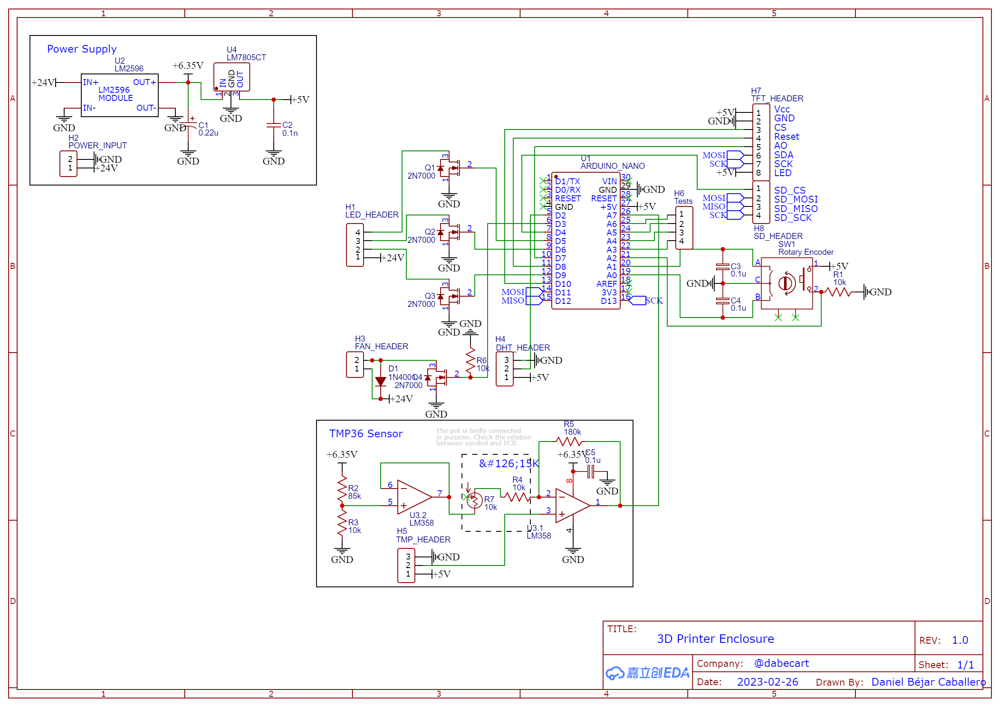
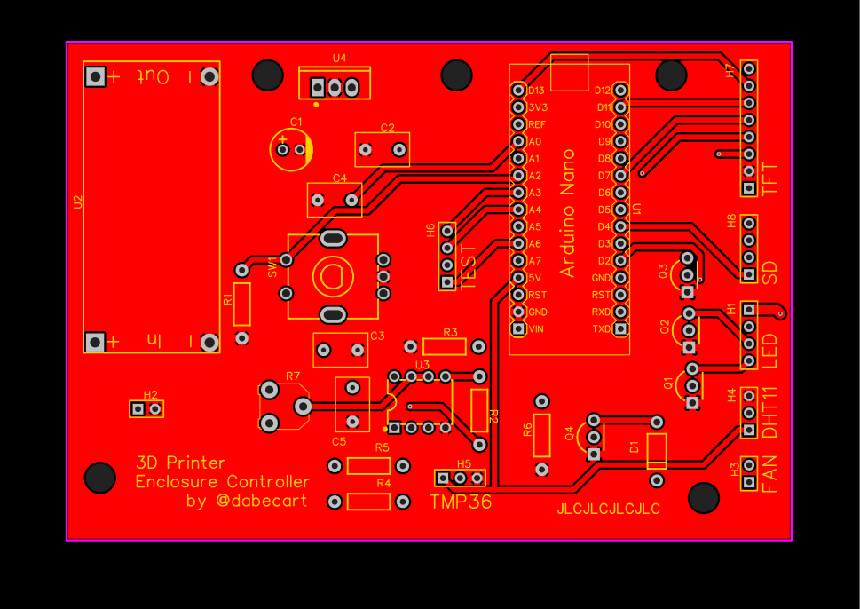
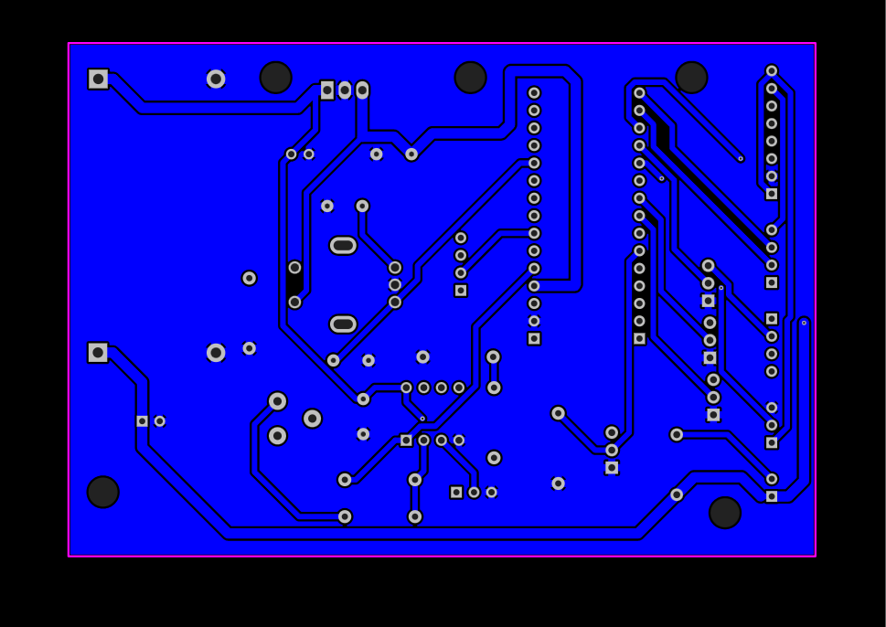

# 3DP_EnclosureController

The 3D Printer Enclosure Controller is a board designed with the main purpose of maintaining a constant temperature and humidity level inside a 3D printer enclosure. 
Furthermore, it can also control LED strips to make some building processes look more appealing! Change it in color, intensity and pattern to suit your taste!

The main board design revolves around an Arduino Nano and a TFT screen controlled with a rotary encoder with a push button. The UI is really intuitive, consisting of several widgets 
that show the most important aspects: temperature, humidity, fan speed and LED control. The temperature and humidity measurement is done by a TMP36 sensor with its OP-Amp circuitry and a DHT11.

At the moment, the temperature and humidity is controlled with an "All-or-nothing" control type, just turning the fan on and off at the speed conveniently specified by the user depending
on the current temperature and humidity. The speed is achieved with a PWM signal directed to a MOSFET circuit (there are some resistors missing from the gate, wups! I'm still learning :=).

## Circuit diagram

PCB and circuit diagrams were made in EasyEDA. Using a coupon, I made five boards for less than 5 euro, incluiding shipping!

## PCBs

Top.

Bot.

